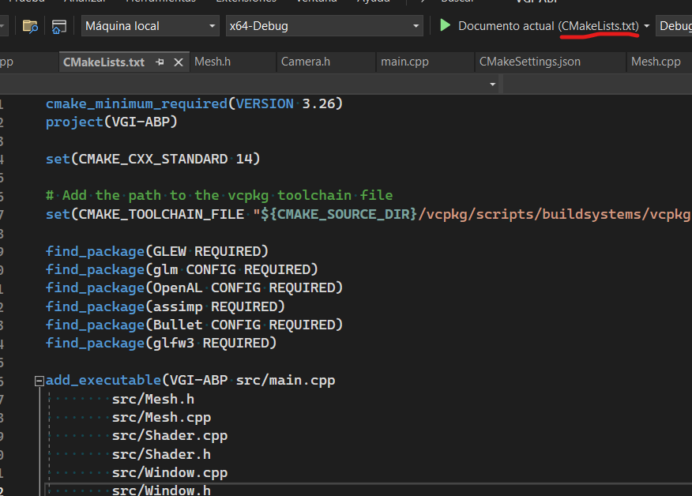

# VGI-ABP Project

Aquest projecte es una demo molt senzilla d'ús de glew i glfw, també inclou llibreries que utilitzarem en el projecte com assimp o openal-soft

# Instalació
 ## Prerequisits
 - Visual studio 2022, comproveu que teniu compatibilitat amb CMake. (e.j. podeu crear projectes de CMake)
 - Alternativament podeu utilitzar CLion pero la instalacó pot variar.
 - Es recomana visual studio com a editor auxiliar i per resoldre merge conflicts.
 - Finalment es recomana que tingueu git o github desktop ja que utilitzarem git com a VCS pel projecte.

## Instalació

Amb git (o amb github desktop) cloneu aquest repositori
```sh
git clone --recurse-submodules https://github.com/JG03dev/VGI-ABP.git
```

Nota: Es possible que us hagueu de logejar a git amb el vostre compte de github si voleu fer commits, ja que el repositori es privat.

Obriu el repositori amb Visual Studio i executeu el fitxer CMakeLists.txt per a comprovar que teniu les llibreries.



I no us surt cap error ja heu acabat 👍✅

Si us surten errors i la compilació de CMake no ha pogut acabar de manera exitosa amb la instalació de llibreries.

## Instalació de llibreries

En aquest projecte, de moment, utilitza les següents llibreries:

- GLEW: Llibreria gràfica de OpenGL que utilitzarem per tots les gràfics.
- GLM: Llibreria matemàtica de OpenGL que ens automatitzarà moltes operacións pels gràfics.
- GLFW: Llibreria per gestionar el input/output del programa, aixo inclou la finestra del programa.
- Assimp: Llibreria d'importació de models.
- OpenAL-soft: Llibreria de audio 3D.

Per instal·lar les llibreries utilitzarem [vcpkg](https://github.com/microsoft/vcpkg) que esta inclos en aquest projecte com a sub-module de git

Per començar obriu una terminal en la carpeta del projecte i executeu el següent per fer l'instalació de vcpkg

```powershell
.\vcpkg\bootstrap-vcpkg.bat
```

A continuació instaleu les llibreries utilitzant la següent comanda

```powershell
.\vcpkg\vcpkg install glew glm glfw3 soil2 openal-soft bullet3
```

Finalment per integrar vcpkg amb les llibreries instalades a visual studio executeu

```powershell
.\vcpkg\vcpkg integrate install
```


